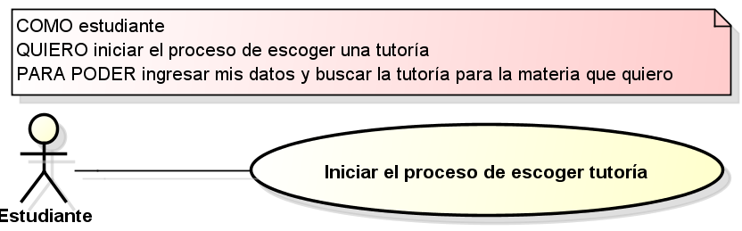
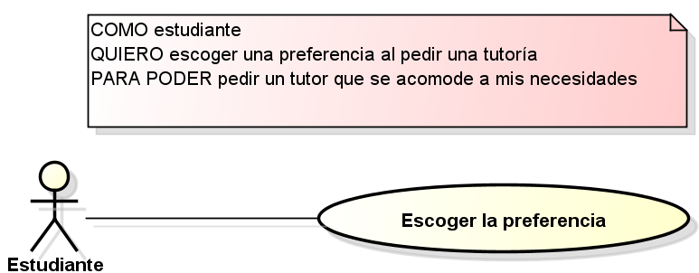
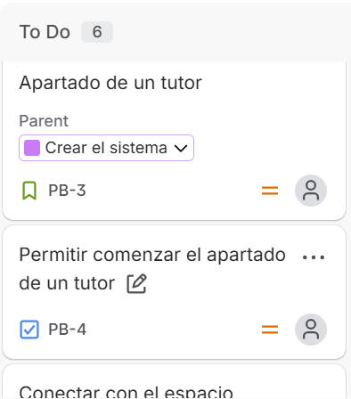
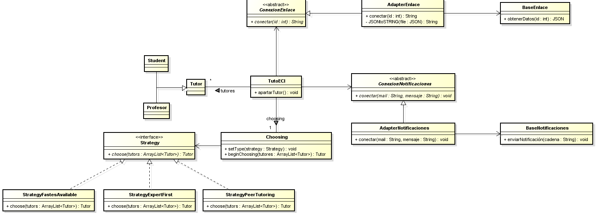

# DOSW_ParcialT1_BrianFierro
-Project Scope
The conext diagram is:

Se agregó los requerimientos a docs/requirements/requirements.md
Junto con las imagenes:

Se realizó la creación de tareas en Jira, el cual tiene un URL: https://brianfierro.atlassian.net/jira/software/projects/PB/boards/34?filter=&groupBy=none
Por lo que quedó como:

Implementando la épica, una historia de usuario y las tareas necesarias para realizar esa historia de usuario.

Para hacer el diagrama de clases, se utilizaron dos patrones de diseño:
1. Adapter
Patrón estructural.
Se utilizó para conectar el sistema de TutoECI con las diferentes plataformas externas, ya que de esta forma se puede aislar los comportamientos realizados al conectarse, así, el sistema principal no se tiene que encargar de hacer esa lógica, además, podemos realizar conversiones aparte para presentar mejor los datos a los sitemas externos o para que el principal los reciba de mejor forma, lo que facilita el manejo de los datos.

2. Strategy
Patrón de comportamiento.
ya que en el sistema se necesitan diferentes estrategias para escoger un tutor, podemos usar este patrón que ayuda a separar las lógicas de las estrategias utilizadas, lo que nos permite tenerla en un sólo lugar si es necesario refactorizar, aparte de que adapter en especial nos permite agregar nuevas estrategias de forma fácil si es necesario después expandir la forma de buscar un tutor.

Al separar de esta forma las cosas a realizar, estamos implementando single responsiblity y con adapter nos permite estar open/closed para que podamos expandir las estrategias sin tener que modificar las ya hechas.
Al implementar estos patrones, el diagrama de clases queda de la siguiente forma:
 